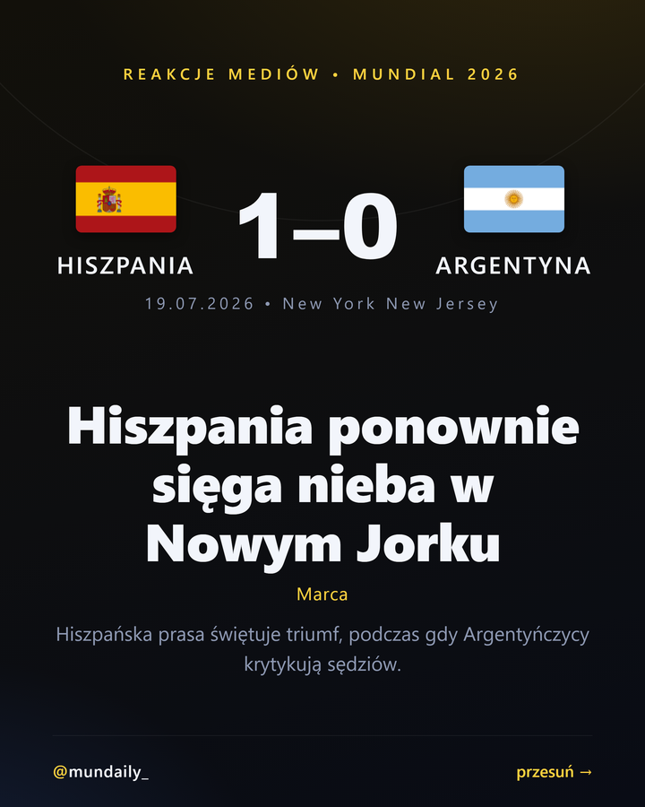
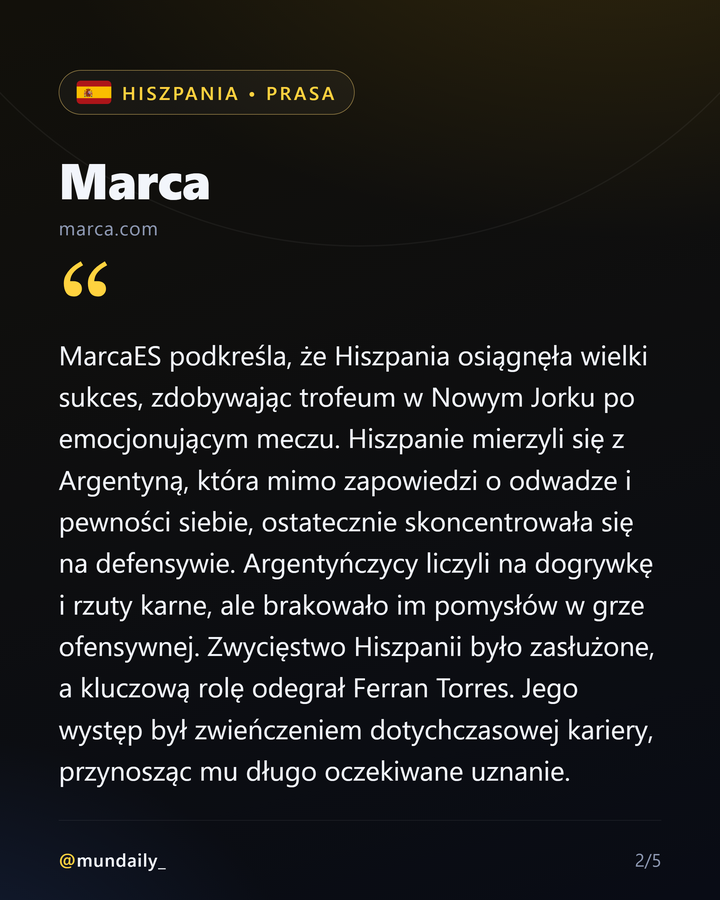
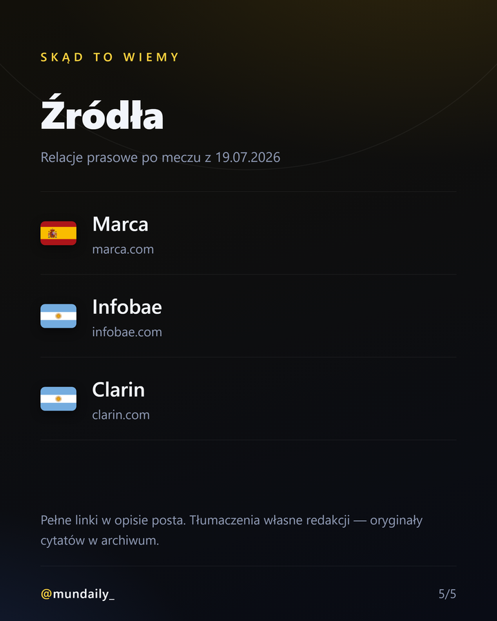
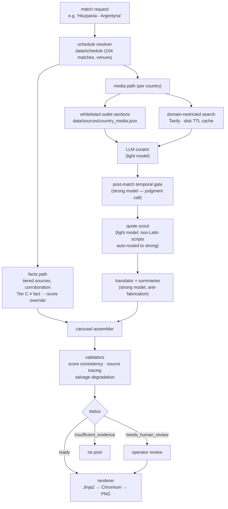

# Mundialo — an AI newsroom that covered the 2026 World Cup

Mundialo is a multi-agent LLM pipeline that turned every match of the 2026 FIFA World Cup
into a publishable Instagram carousel answering one question: **"how did the press of both
countries react?"** It monitored 111 newspapers across 48 national teams in 17 languages
(Spanish, Arabic, Farsi, Japanese, Korean, Uzbek, Norwegian…), curated and extracted press
quotes with LLMs, translated them into Polish, verified them against match facts, and
rendered the result as ready-to-post graphics — all operated end-to-end by a single person.

**It ran for real:** all 104 tournament matches covered and published during the
tournament (June 11 – July 19, 2026) on Instagram as
[@mundaily_](https://www.instagram.com/mundaily_/) — 254 archived pipeline runs
(≈ 2.4 per match; re-rolls and fixes were the operating model), 431 tests, and ≈ $10
of model API spend for the entire World Cup.

## Sample output (the actual final: Spain 1–0 Argentina)

| Title slide | Country slide (press quote) | Sources slide |
|---|---|---|
|  |  |  |

Each post is a 5–6 slide carousel: title → up to 2 slides per country (quote + summary,
translated to Polish, outlet attributed) → sources slide, plus a generated caption and an
X post. Rendering: Jinja2 → HTML → headless Chromium (Playwright), 1080×1350.

## How it works



Cross-cutting infrastructure, independent of any single stage:

- **EvidenceStore** — every claim on a slide must trace to a stored source; copy agents
  may only cite `claim_ids` that exist in the store, so sources cannot be hallucinated.
- **SourceRegistry** — per-country domain whitelist with source tiers; tier C (social,
  aggregators) can color a narrative but never establish a fact.
- **ModelGateway** — provider-agnostic LLM access with hand-rolled structured output,
  validation, retry-with-feedback, and a deterministic offline fallback (the whole test
  suite runs without API keys).
- **Model routing** — the pipeline splits stages between a light and a strong model by
  task shape: extraction guarded by validators runs on the cheap model; unguarded
  judgment calls (the temporal gate, summaries) run on the strong one.
- **Editorial voice as semantic memory** — `VoiceProfile` (banned phrases, hook patterns,
  few-shot pairs) injected into every writing agent.
- **Episodic memory** — each run appends per-outlet health telemetry
  (`runs/.outlet_health.json`); later runs consume it as advisories and re-order outlet
  sections. `python -m app.health` prints the learned state of the source network.
- **Full audit trail** — every run persists request, evidence, tool calls, model choices,
  and decision notes to `runs/run_*/run.json`; every bug in this project was debugged
  from that file.

## Why it's harder than it looks

A World Cup is an adversarial environment for an LLM pipeline. The interesting problems,
all hit in production and fixed with regression tests:

- **Retrieval is a language problem.** "Netherlands" finds nothing in the French press —
  queries need per-language exonyms ("Pays-Bas"), local tournament vocabulary
  ("MS 2026", "WK 2026", "فيفا مونديال"), and non-Latin scripts for Arabic and Farsi
  outlets. English-centric queries silently return an empty panel.
- **Time is the hardest dimension.** Some outlets publish undated URLs, so a pre-match
  press-conference story can masquerade as a match report. Deterministic date filters
  are helpless; a dedicated LLM temporal gate ("is this post-match?") on the strong
  model closes the door — the light model failed that binary judgment reliably.
- **Anti-hallucination guards false-positive.** The digit guard (numbers on a slide must
  exist in the source article) flagged "1/8 finału" (Polish for round of 16) as a
  fabricated "8". The score-consistency guard flagged halftime scores and penalty
  shootouts as contradictions. Every guard needs domain vocabulary, per language.
- **The web fights back.** Bot-blocking outlets (403s at article level), paywalls,
  JS-only pages that return navigation chrome, and sections that drift to new URLs
  mid-tournament. The episodic memory layer exists because of this.
- **Graceful degradation beats failure.** A summary that keeps violating its contract
  after retries is salvaged down to a bare attributed quote instead of sinking the whole
  post; a gate false-reject is resurrected when the article's slug corroborates the
  final score. `needs_human_review` is a first-class outcome, not an error.

The full war-story writeup with the engineering lessons: **[CASE_STUDY.md](CASE_STUDY.md)**.

## Repo tour

| Path | What it is |
|---|---|
| `app/orchestration/` | Coordinator: the editorial workflow, status machine (`ready` / `needs_human_review` / `insufficient_evidence`) |
| `app/agents/` | LLM roles: media curator, post-match gate, quote scout, translator/editorial, copywriter, facts scout |
| `app/tools/` | Tool gateway: schedule, search (Tavily + disk TTL cache), fetch, domain contracts, registry |
| `app/memory/` | Voice profile (semantic), evidence store, episodic outlet-health memory |
| `app/models/` | Provider-agnostic model gateway, hand-rolled structured output with retry |
| `app/render/` | Slide specs + Jinja2/Chromium renderer (`python -m app.render`) |
| `app/evaluation/` | Scenario harness with assertions, leaderboard (40 fact-check / 40 quality / 20 angle) |
| `app/observability/` | Telemetry events feeding the episodic layer |
| `app/health.py` | CLI over learned outlet health (`python -m app.health`) |
| `data/sources/country_media.json` | The outlet registry: 48 teams, 111 outlets, 17 languages, per-country search hints (exonyms, local vocabulary) |
| `data/schedule/` | Tournament schedule (104 matches, venues, kickoffs) |
| `scripts/roadmap.py` | Operator dashboard: render status per match |
| `.claude/skills/debug-match-content/` | Claude Code skill encoding the triage tree from symptom to fix — the ops runbook as an executable skill |
| `tests/` | 431 tests, offline, ~5 s, no API keys required |

Design docs (Polish): `architektura-redakcji-ai-mundial-instagram.md` (system),
`architektura-relacje-medialne.md` (media track), `architektura-pamiec-epizodyczna.md`
(episodic memory), `architektura-warstwy-graficznej.md` (rendering), `glos-redakcji.md`
(editorial voice), `runbook-mecz.md` (match-day ops).

## Running it

Offline demo — deterministic, no API keys (fixtures + fake gateway):

```bash
python -m app --match "Meksyk - RPA" --pretty
python -m unittest discover -s tests     # 431 tests, ~5 s
```

Full live run (requires `OPENAI_API_KEY` + `TAVILY_API_KEY`; `pip install ".[llm,research]"`):

```bash
python -m app --match "Hiszpania - Argentyna" --date 2026-07-19 \
  --llm --research --model gpt-4o --light-model gpt-4o-mini \
  --render --save-run --pretty
```

Re-render the latest saved run (including review-gated ones, for preview):

```bash
python -m app.render --allow-review
```

Note: the product's audience is Polish, so the CLI surface, run notes, and editorial
output are in Polish; code identifiers are English.

## Numbers

| | |
|---|---|
| Tournament matches covered / published | 104 / 104 |
| Archived pipeline runs | 254 (June 9 – July 19, 2026) — ≈ 2.4 per match |
| Outlet registry | 48 teams · 111 outlets · 17 languages |
| Tests | 431, offline, ~5 s |
| Application code | ~10.7k lines of Python |
| Output per match | 5–6 slide carousel + caption + X post |
| Model API spend, whole tournament | ≈ $10 (6.2M input tokens) — ≈ $0.10 per published post |

## Status

The tournament is over; the system is complete and in showcase mode. The operational
archive (`runs/`, ~1 GB of run.json files and rendered slides) lives outside git —
a curated sample is in `docs/demo/`.
