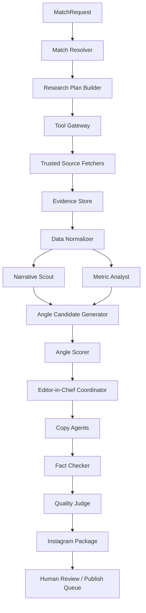

# Architektura systemu agentow AI dla redakcji mundialowej na Instagram

Stan dokumentu: 2026-06-09  
Cel MVP: po podaniu meczu system zwraca gotowy tekst do "puszki" na Instagram: Reel, karuzela, stories, opis posta, lista zrodel i raport fact-check.

## 1. Idea produktu

System nie ma byc chatbotem, ktory "pisze analize meczu". Ma byc kontrolowana redakcja agentowa, ktora po meczu znajduje jeden mocny insight i pakuje go w internetowy format.

Glowny format redakcyjny:

> Sprawdzamy mundialowe narracje danymi.

Kluczowe pytanie po kazdym meczu:

> Co dane pokazuja, czego nie widac w samym wyniku?

Z rozmowy wynika kilka decyzji produktowych:

- nie dokumentujemy calego mundialu "o wszystkim";
- kazda puszka ma jedna teze;
- wygrywa napiecie: wynik kontra przebieg, narracja kontra dane, gwiazda kontra realny wplyw;
- output ma byc zrozumialy dla kibica, a nie dla analityka;
- system ma dzialac szybko po meczu, ale nie kosztem weryfikowalnosci;
- nie uzywamy fragmentow transmisji jako materialu bazowego;
- dane i wykresy musza prowadzic do prostego wniosku, nie do raportu.

## 2. Zakres MVP

### Wejscie

Uzytkownik podaje mecz, tryb i opcjonalne ograniczenia.

Przyklad:

```json
{
  "match_query": "PSG - Arsenal, final Ligi Mistrzow, 2026-05-30",
  "mode": "post_match",
  "language": "pl",
  "target_format": ["reel", "carousel", "stories", "caption"],
  "speed_mode": "quality_90_min",
  "allow_unverified_claims": false
}
```

### Wyjscie

System zwraca strukture, a nie sam wolny tekst.

```json
{
  "package_id": "string",
  "match": {},
  "editorial_angle": {},
  "reel_script": {},
  "carousel_slides": [],
  "stories": [],
  "caption": {},
  "visual_brief": {},
  "sources": [],
  "fact_check": {},
  "quality_report": {},
  "status": "ready | needs_human_review | insufficient_evidence"
}
```

### Poza zakresem MVP

- automatyczna publikacja na Instagramie;
- generowanie finalnych grafik i wideo;
- obstawianie wynikow;
- samodzielne wykonywanie akcji prawnych, finansowych albo zakupowych;
- uzywanie niezweryfikowanych kont social jako zrodla faktow;
- mieszanie danych xG z roznych providerow bez jawnego oznaczenia.

## 3. Zasady projektowe

System musi byc budowany w kolejnosci:

1. kontrakty danych;
2. structured output;
3. walidacja i auto-repair;
4. RAG i kontrolowane zrodla;
5. context builder;
6. pamiec selektywna;
7. tool gateway;
8. petla agentowa;
9. multi-agent;
10. ewaluacja i leaderboard.

Najwazniejsza konsekwencja: model nie jest redakcja. Model jest komponentem redakcji. Kod steruje workflow, wyborem narzedzi, walidacja, retry, logowaniem i warunkami stopu.

## 4. Architektura wysokiego poziomu



## 5. Warstwy systemu

### 5.1. API / interfejs wejscia

Minimalnie:

- CLI: `generate-package --match "PSG - Arsenal, final LM 2026" --mode post_match`;
- endpoint: `POST /instagram-packages`;
- zapis sesji: `runs/{run_id}/`.

API nie przekazuje promptu bezposrednio do modelu. Najpierw tworzy `MatchRequest`, waliduje go i dopiero potem uruchamia workflow.

### 5.2. Match Resolver

Zadanie: zamienic naturalny opis meczu na jednoznaczny rekord.

Input:

- `match_query`;
- tryb: pre-match, live, post-match;
- data, jezeli podana;
- rozgrywki, jezeli podane.

Output:

```json
{
  "match_id": "provider-specific-id",
  "competition": "UEFA Champions League",
  "stage": "final",
  "home_team": "Paris Saint-Germain",
  "away_team": "Arsenal",
  "kickoff_utc": "2026-05-30T16:00:00Z",
  "status": "finished",
  "resolution_confidence": "high",
  "ambiguities": []
}
```

Walidacje:

- jezeli istnieje wiecej niz jeden kandydat, status `needs_human_review`;
- jezeli mecz nie zostal znaleziony w zaufanym zrodle, status `insufficient_evidence`;
- daty wzgledne typu "dzisiaj" sa zamieniane na konkretna date.

### 5.3. Source Registry

System ma jawny katalog zrodel i ich roli.

Tier A: fakty podstawowe

- FIFA Match Centre dla mundialu;
- UEFA Match Centre dla Ligi Mistrzow;
- oficjalne strony rozgrywek, federacji i klubow;
- oficjalne protokoly meczowe.

Tier B: dane statystyczne

- FotMob;
- SofaScore;
- Flashscore;
- WhoScored;
- FBref;
- Statbunker;
- Opta Analyst;
- StatsBomb, Wyscout albo SkillCorner tylko jezeli mamy legalny dostep/licencje.

Tier C: narracje i inspiracje

- X/Twitter;
- Reddit;
- portale sportowe;
- komentarze ekspertow;
- komentarze kibicow.

Zasada: Tier C nigdy nie jest samodzielnym zrodlem faktu. Moze byc zrodlem narracji, ktora potem sprawdzamy danymi.

### 5.4. Tool Gateway

Model nie dostaje dowolnego internetu. Dostaje opis narzedzi, ale wykonanie idzie przez bramke.

Funkcje bramki:

- whitelist domen;
- walidacja parametrow;
- limity kosztu i czasu;
- logowanie kazdego wywolania;
- rozdzielenie discovery od execution;
- cache odpowiedzi;
- oznaczenie zrodla, providerow metryk i timestampu pobrania.

Przyklad narzedzi:

```text
resolve_match(query, date_hint, competition_hint)
fetch_match_facts(match_id, provider)
fetch_team_stats(match_id, provider)
fetch_player_stats(match_id, provider)
fetch_public_narratives(match_id, trusted_query_set)
search_knowledge_base(query, filters)
render_chart_brief(metric_snapshot)
```

### 5.5. Evidence Store

Kazda liczba i kazdy fakt musza miec slad.

`EvidenceItem`:

```json
{
  "claim": "PSG pokonalo Arsenal po rzutach karnych",
  "value": "PSG win on penalties",
  "source_url": "https://...",
  "source_tier": "A | B | C",
  "provider": "UEFA | FotMob | SofaScore | ...",
  "retrieved_at": "2026-06-09T22:15:00Z",
  "confidence": "high | medium | low",
  "used_in_output": true
}
```

Reguly:

- claim bez `EvidenceItem` nie moze trafic do finalnego tekstu;
- jezeli dwa zrodla roznia sie w metryce, system raportuje konflikt;
- xG z roznych providerow nie jest laczone w jednej interpretacji bez adnotacji;
- jezeli zrodlo znika lub jest niedostepne, wynik przechodzi w `needs_human_review`.

### 5.6. RAG / Knowledge System

RAG przechowuje nie tylko dokumenty, ale mape wiedzy.

Typy wiedzy:

- regulamin mundialu 2026;
- format awansu z grupy;
- terminarz;
- slownik metryk: xG, PSxG, PPDA, field tilt, box entries;
- style redakcyjne;
- poprzednie puszki;
- checklisty fact-check;
- licencje i zasady uzycia materialow.

Pipeline RAG:

1. ingest dokumentu;
2. parsing do markdown + metadane;
3. normalizacja dat, druzyn, rozgrywek, metryk;
4. indeks hybrydowy: tekst, embeddingi, metadane;
5. retrieve pod konkretne pytanie;
6. rerank;
7. compose context;
8. generate ze schematem i cytowaniami;
9. verify.

### 5.7. Context Builder

Nie ma jednego wielkiego promptu. Jest dynamiczny `ContextBuilder`.

Dla kazdego kroku sklada:

- misje kroku;
- stan workflow;
- minimalny zestaw faktow;
- dozwolone narzedzia;
- zasady redakcyjne;
- przyklady formatow;
- istotna pamiec;
- ograniczenia prawne;
- wymagany schema output.

Ochrona przed problemami kontekstu:

- poisoning: tresc z internetu jest oznaczana jako nieufna;
- distraction: kazdy agent dostaje tylko swoje dane;
- confusion: konflikty zrodel sa jawnie oznaczone;
- clash: instrukcje systemowe i polityki bramki maja priorytet nad trescia stron.

## 6. Pamiec systemu

Minimalny zestaw warstw:

### Core memory

Stale zasady redakcji:

- jedna puszka = jedna mysl;
- prosty jezyk dla kibica;
- kazda liczba ma zrodlo;
- nie uzywamy klipow z transmisji;
- nie udajemy pewnosci, gdy brakuje danych.

### Procedural memory

Checklisty:

- pipeline 45 minut;
- pipeline 90 minut;
- fact-check;
- format karuzeli;
- format Reela;
- format stories.

### Semantic memory

Wiedza domenowa:

- definicje metryk;
- archetypy angle'ow;
- slownik tonow i zakazanych sformulowan;
- zasady interpretowania statystyk.

### Episodic memory

Historia produkcji:

- poprzednie puszki;
- wybrane angle;
- wyniki postow;
- komentarze odbiorcow;
- bledy i korekty.

### Working memory

Tylko aktualny mecz:

- fakty;
- dane;
- narracje;
- kandydaci angle;
- decyzja redakcyjna;
- wersje copy.

Regula: pamiec jest selekcja, nie archiwum calej rozmowy.

## 7. Role agentow

Multi-agent ma sens tylko dlatego, ze role redakcyjne maja rozne kontrakty. W MVP moga to byc kolejne kroki w jednym orchestratorze, a nie osobne autonomiczne byty.

### 7.1. Editor-in-Chief Coordinator

Odpowiedzialnosc:

- prowadzi workflow;
- wybiera stop condition;
- decyduje, czy material jest gotowy;
- wysyla do human review, gdy ryzyko jest za wysokie.

Nie generuje sam faktow.

### 7.2. Match Researcher

Odpowiedzialnosc:

- rozpoznaje mecz;
- zbiera wynik, strzelcow, minuty, kartki, karne, dogrywke;
- tworzy `MatchFacts`.

Output:

```json
{
  "match_facts": {},
  "missing_fields": [],
  "source_conflicts": [],
  "confidence": "high"
}
```

### 7.3. Data Hunter

Odpowiedzialnosc:

- zbiera statystyki druzynowe i zawodnikow;
- oddziela dane szybkiego uzycia od danych wolniejszych;
- oznacza providera kazdej metryki.

Minimalne dane po meczu:

- wynik;
- gole i minuty;
- strzaly;
- strzaly celne;
- xG, jezeli dostepne;
- duze okazje;
- posiadanie;
- kontakty w polu karnym albo wejscia w final third, jezeli dostepne;
- dane bramkarza;
- dane kluczowych zawodnikow;
- kontekst grupy albo fazy turnieju.

### 7.4. Narrative Scout

Odpowiedzialnosc:

- zbiera pierwsza narracje z internetu;
- nie traktuje sociali jako zrodla faktow;
- zapisuje, co "wszyscy mowia", zeby potem sprawdzic to danymi.

Output:

```json
{
  "public_narratives": [
    {
      "narrative": "Arsenal przegral przez defensywne cofniecie po szybkim golu",
      "source_type": "media | social | expert",
      "evidence_url": "https://...",
      "verification_status": "narrative_only"
    }
  ]
}
```

### 7.5. Metric Analyst

Odpowiedzialnosc:

- interpretuje dane;
- szuka anomalii;
- nie pisze copy;
- zwraca fakty i mozliwe hipotezy z poziomem pewnosci.

Zakazane:

- zbyt mocne wnioski z jednej liczby;
- "na pewno", gdy dane pozwalaja tylko na "sugeruje";
- porownywanie nieporownywalnych metryk.

### 7.6. Angle Editor

Odpowiedzialnosc:

- tworzy kandydatow angle;
- przypisuje archetyp;
- ocenia potencjal redakcyjny.

Archetypy:

1. wynik klamie;
2. jedna liczba wyjasnia mecz;
3. bohater, ktorego nie widac w skrocie;
4. gwiazda pod lupa;
5. zmiana, ktora odwrocila mecz;
6. pulapka posiadania;
7. co to znaczy dla grupy albo dalszej fazy.

Score angle'u:

```json
{
  "surprise": 0,
  "simplicity": 0,
  "emotion": 0,
  "evidence_strength": 0,
  "comment_potential": 0,
  "total": 0
}
```

Regula: glowny angle musi miec minimum 7/10. Jezeli zaden nie ma 7/10, system robi bezpieczny format: "3 liczby po meczu, ktore warto znac".

### 7.7. Copywriter

Odpowiedzialnosc:

- zamienia decyzje redakcyjna na jezyk socialowy;
- pisze hook, voice-over, slajdy i CTA;
- nie dodaje nowych faktow.

Kontrakt:

- uzywa tylko faktow z `EditorialBrief`;
- kazde zdanie z liczba musi miec `evidence_id`;
- pisze prostym jezykiem.

### 7.8. Social Format Editor

Odpowiedzialnosc:

- pilnuje struktury Reela, karuzeli i stories;
- tworzy visual brief dla grafika albo generatora plansz;
- sprawdza, czy tekst zmiesci sie na telefonie.

### 7.9. Fact Checker

Odpowiedzialnosc:

- sprawdza claimy z Evidence Store;
- wykrywa konflikty;
- oznacza claimy niewystarczajaco potwierdzone;
- rekomenduje wording ostrozniejszy.

### 7.10. Quality Judge

Odpowiedzialnosc:

- odpala binarne testy jakosci;
- ocenia zgodnosc z formatem;
- nie jest "sedzia estetyczny", tylko walidator kontraktu.

## 8. Glowne schematy danych

### 8.1. MatchRequest

```json
{
  "match_query": "string",
  "date_hint": "YYYY-MM-DD | null",
  "competition_hint": "string | null",
  "mode": "pre_match | post_match | daily_roundup",
  "language": "pl",
  "target_format": ["reel", "carousel", "stories", "caption"],
  "speed_mode": "fast_45_min | quality_90_min",
  "allow_unverified_claims": false
}
```

### 8.2. MatchFacts

```json
{
  "match_id": "string",
  "competition": "string",
  "stage": "string",
  "date": "YYYY-MM-DD",
  "teams": {
    "home": "string",
    "away": "string"
  },
  "score": {
    "full_time": "string",
    "after_extra_time": "string | null",
    "penalties": "string | null"
  },
  "goals": [],
  "cards": [],
  "key_events": [],
  "sources": []
}
```

### 8.3. MetricSnapshot

```json
{
  "provider": "string",
  "retrieved_at": "ISO-8601",
  "team_metrics": {
    "home": {},
    "away": {}
  },
  "player_metrics": [],
  "metric_warnings": [
    "xG provider differs from previous run"
  ],
  "sources": []
}
```

### 8.4. AngleCandidate

```json
{
  "archetype": "result_lies | one_number | quiet_hero | star_under_lens | tactical_shift | possession_trap | group_context",
  "thesis": "string",
  "tension": "string",
  "main_number": {
    "label": "string",
    "value": "string",
    "evidence_id": "string"
  },
  "supporting_claims": [],
  "score": {
    "surprise": 0,
    "simplicity": 0,
    "emotion": 0,
    "evidence_strength": 0,
    "comment_potential": 0,
    "total": 0
  },
  "risk": "low | medium | high",
  "missing_evidence": []
}
```

### 8.5. EditorialBrief

```json
{
  "selected_angle": {},
  "one_sentence_thesis": "Wynik mowi, ze X, ale dane pokazuja Y, bo Z.",
  "allowed_claims": [],
  "forbidden_claims": [],
  "tone": "prosty, szybki, bez zargonu",
  "cta_goal": "comments | saves | shares",
  "visual_options": ["xg_timeline", "shot_map", "three_metric_table"]
}
```

### 8.6. InstagramPackage

```json
{
  "reel_script": {
    "hook": "string",
    "voiceover": [
      {
        "time_range": "0-3s",
        "text": "string",
        "claim_ids": []
      }
    ],
    "on_screen_text": [],
    "cta": "string"
  },
  "carousel": {
    "slides": [
      {
        "slide_number": 1,
        "role": "hook | context | number | chart | interpretation | hero_problem | cta",
        "headline": "string",
        "body": "string",
        "claim_ids": [],
        "visual_brief": "string"
      }
    ]
  },
  "stories": [],
  "caption": {
    "text": "string",
    "hashtags": [],
    "source_note": "string"
  }
}
```

### 8.7. ValidationReport

```json
{
  "status": "pass | fail | needs_human_review",
  "checks": [
    {
      "name": "all_numeric_claims_have_sources",
      "result": "pass",
      "details": ""
    }
  ],
  "blocking_issues": [],
  "warnings": []
}
```

## 9. Workflow po meczu

### Krok 1. Resolve match

System ustala, o ktory mecz chodzi.

Stop condition:

- `MatchFacts.status = resolved`;
- brak nierozwiazanych dwuznacznosci.

### Krok 2. Zbierz fakty

Pobieramy:

- wynik;
- strzelcow;
- minuty bramek;
- kartki;
- karne;
- dogrywke;
- serie rzutow karnych;
- sklad i zmiany, jezeli potrzebne.

### Krok 3. Zbierz metryki

Dane szybkie:

- strzaly;
- strzaly celne;
- xG, jezeli dostepne;
- posiadanie;
- duze okazje;
- kontakty w polu karnym;
- rogi i stale fragmenty;
- interwencje bramkarza;
- wybrane metryki zawodnikow.

Dane wolniejsze:

- PPDA;
- field tilt;
- progresywne podania;
- sekwencje pressingowe;
- PSxG;
- dane trackingowe, jezeli licencja pozwala.

### Krok 4. Zbierz narracje

System szuka odpowiedzi na pytanie:

> Co kibice i media powiedza po tym meczu w pierwszej godzinie?

Przyklady narracji:

- "druzyna kontrolowala mecz";
- "gwiazda zawiodla";
- "sedzia wypaczyl wynik";
- "bramkarz uratowal zespol";
- "trener przegral zmianami";
- "posiadanie pokazuje dominacje".

Kazda narracja ma status `narrative_only`, dopoki nie zostanie sprawdzona danymi.

### Krok 5. Znajdz napiecia redakcyjne

System sprawdza liste napiec:

- wynik vs przebieg;
- posiadanie vs zagrozenie;
- gwiazda vs wplyw;
- bramkarz vs narracja;
- strzaly vs jakosc;
- pierwsza polowa vs druga polowa;
- stale fragmenty vs gra z gry;
- awans vs jakosc gry;
- zawodnik z cienia;
- internetowa narracja vs liczby.

### Krok 6. Wygeneruj i ocen angle

Kazdy kandydat dostaje 0-2 punkty za:

- zaskoczenie;
- prostote;
- emocje;
- sile danych;
- potencjal komentarzy.

Wygrywa angle 7/10 lub lepszy. Przy braku zwyciezcy system przechodzi na bezpieczny format.

### Krok 7. Stworz EditorialBrief

Brief musi zawierac:

- jedna teze;
- jedna glowna liczbe;
- maksymalnie trzy claimy wspierajace;
- ryzyka interpretacyjne;
- zakazane sformulowania;
- proponowany wykres;
- CTA.

### Krok 8. Napisz copy

Copywriter tworzy:

- Reel 30-60 sekund;
- karuzele 5-7 slajdow;
- stories 3-5 ekranow;
- opis posta;
- visual brief.

### Krok 9. Fact-check

Fact Checker sprawdza:

- czy wynik i minuty sa poprawne;
- czy metryki pochodza z oznaczonego zrodla;
- czy provider xG jest jeden w ramach interpretacji;
- czy wniosek nie jest mocniejszy niz dane;
- czy hook nie obiecuje wiecej niz material dowozi;
- czy nie uzyto materialow z transmisji;
- czy kazdy claim ma `evidence_id`.

### Krok 10. Quality Judge

Testy binarne:

- output ma jedna teze;
- Reel ma hook w pierwszych 3 sekundach;
- karuzela ma 5-7 slajdow;
- slajd 1 jest napieciem, nie opisem;
- jest jedna glowna liczba;
- jest CTA;
- zrodla sa podane;
- liczby maja evidence;
- status nie jest `ready`, jezeli sa konflikty zrodel;
- jezyk jest zrozumialy dla kibica.

## 10. Format finalnej puszki

### Reel

Struktura:

```text
0-3s: hook
3-10s: kontekst meczu
10-25s: jedna liczba
25-45s: interpretacja
45-60s: konsekwencja i CTA
```

### Karuzela

1. Hook.
2. Wynik i glowna teza.
3. Liczba meczu.
4. Wykres albo mini-tabela.
5. Interpretacja.
6. Bohater albo problem.
7. CTA.

### Stories

3-5 ekranow:

- ankieta;
- quiz;
- slider;
- liczba meczu;
- pytanie pod kolejna puszke.

### Caption

Opis ma:

- powtorzyc teze;
- dac zrodla metryk;
- nie wprowadzac nowych faktow;
- zapraszac do komentarza.

## 11. Polityka halucynacji i niepewnosci

System musi umiec powiedziec:

- `unknown`;
- `insufficient_evidence`;
- `needs_human_review`;
- `conflicting_sources`;
- `metric_unavailable`.

Przyklady:

- jezeli xG nie jest dostepne w zaufanym zrodle, nie wolno go wymyslac;
- jezeli tylko jedno zrodlo podaje dziwna liczbe, wording staje sie ostrozniejszy;
- jezeli nie ma danych o PPDA, system nie robi angle'u o pressingu;
- jezeli social media sugeruja kontrowersje sedziowska, potrzebne jest zrodlo wideo/opis z zaufanego medium albo material idzie do review.

## 12. Przyklad testowy: PSG - Arsenal

Mecz testowy:

```json
{
  "match_query": "PSG - Arsenal, final Ligi Mistrzow, 2026-05-30",
  "mode": "post_match",
  "speed_mode": "quality_90_min",
  "target_format": ["reel", "carousel", "stories", "caption"]
}
```

Oczekiwane zachowanie systemu:

1. Resolve match jako final UEFA Champions League 2025/26.
2. Potwierdzic date, miejsce, druzyny i wynik w zaufanych zrodlach.
3. Oddzielic fakty meczowe od narracji medialnych.
4. Pobrac statystyki z minimum jednego providera danych.
5. Jezeli dostepne sa tylko dane podstawowe, nie tworzyc zaawansowanego angle'u o pressingu albo xG.
6. Wygenerowac 3-5 kandydatow angle.
7. Wybrac jeden angle z wynikiem minimum 7/10.
8. Wygenerowac Reel, karuzele, stories i caption.
9. Zablokowac finalny status `ready`, jezeli brakuje zrodel dla kluczowych claimow.

Przykladowe kandydaty angle, ktore system moze rozwazyc dopiero po weryfikacji danych:

- "Arsenal byl o krok od trofeum, ale final zamienil sie w test bronienia przewagi";
- "Wynik po 120 minutach wyglada jak rownowaga, ale statystyki moga pokazywac przewage terytorialna jednej strony";
- "Najglosniejsza narracja to rzuty karne, ale w danych moze byc widac problem wczesniej";
- "Cichy bohater finalu nie musi byc strzelec gola, tylko zawodnik kontrolujacy przejscia albo bramkarz".

Przyklad bezpiecznego outputu, gdy brakuje pelnych danych:

```json
{
  "status": "needs_human_review",
  "reason": "Brakuje zweryfikowanych danych xG i metryk zawodnikow. Mozna przygotowac wersje oparta na wyniku, przebiegu i podstawowych statystykach, ale nie wolno uzywac zaawansowanych wnioskow.",
  "fallback_angle": "Final rozstrzygnely karne, ale material powinien sprawdzic, czy ten mecz rzeczywiscie byl tak wyrownany, jak sugeruje wynik po dogrywce."
}
```

## 13. Ewaluacja i leaderboard

Quality harness powinien miec scenariusze:

- mecz z pelnym pakietem danych;
- mecz bez xG;
- mecz z konfliktem zrodel;
- mecz z czerwona kartka;
- mecz po karnych;
- mecz z dominacja posiadania bez zagrozenia;
- mecz z kontrowersja sedziowska;
- mecz fazy grupowej, gdzie wazny jest kontekst awansu;
- mecz z gwiazda, ktora nie ma gola ani asysty;
- mecz bez mocnego angle'u.

Metryki:

- pass rate walidacji;
- procent claimow ze zrodlami;
- unknown rate;
- hallucination catch rate;
- sredni czas wygenerowania puszki;
- koszt na puszke;
- liczba human review;
- skutecznosc angle score vs wyniki posta;
- liczba korekt po publikacji.

Leaderboard porownuje:

- wersje promptow;
- modele;
- strategie retrieve;
- archetypy angle;
- formaty hookow;
- style copy.

## 14. Observability

Kazdy run zapisuje:

- input;
- wersje promptow;
- wersje schematow;
- uzyte modele;
- kontekst wyslany do modelu;
- narzedzia i ich parametry;
- odpowiedzi zrodel;
- evidence ledger;
- wszystkie outputy structured;
- bledy walidacji;
- retry i auto-repair;
- koszt;
- latency;
- decyzje koordynatora.

Wymaganie produkcyjne: kazda puszka musi byc odtwarzalna przez replay.

## 15. Bezpieczenstwo, prawa i governance

Zasady:

- brak automatycznej publikacji bez czlowieka w petli;
- brak uzycia klipow z transmisji;
- grafiki i dane tylko z legalnych zrodel;
- social media jako inspiracja, nie fakt;
- prompt injection ze stron internetowych jest ignorowany jako instrukcja;
- narzedzia write/post sa domyslnie zablokowane;
- kazda zmiana promptu albo schematu przechodzi testy.

## 16. Proponowana struktura repozytorium

```text
mundial-redakcja-ai/
  app/
    api/
      routes.py
    orchestration/
      coordinator.py
      workflow.py
      stop_conditions.py
    agents/
      match_researcher.py
      data_hunter.py
      narrative_scout.py
      metric_analyst.py
      angle_editor.py
      copywriter.py
      social_format_editor.py
      fact_checker.py
      quality_judge.py
    context/
      builder.py
      policies.py
      templates/
    memory/
      store.py
      selectors.py
      compression.py
    rag/
      ingest.py
      parse.py
      index.py
      retrieve.py
      verify.py
    tools/
      gateway.py
      registry.py
      sources/
        fifa.py
        uefa.py
        fotmob.py
        sofascore.py
        fbref.py
    schemas/
      match.py
      evidence.py
      metrics.py
      angles.py
      package.py
      validation.py
    evaluation/
      scenarios/
        psg_arsenal_ucl_final_2026.json
        match_without_xg.json
        conflicting_sources.json
      judges.py
      leaderboard.py
      reports.py
    observability/
      logging.py
      replay.py
      metrics.py
  docs/
    architecture.md
    domain.md
    editorial_policy.md
    source_policy.md
    quality_contract.md
    threat_model.md
  tests/
    test_match_resolver.py
    test_structured_outputs.py
    test_source_policy.py
    test_angle_scoring.py
    test_fact_check.py
    test_package_contract.py
```

## 17. Kolejnosc budowy

### Etap 0: kontrakt jakosci

- spisac definicje dobrej puszki;
- stworzyc 20 scenariuszy testowych;
- zdefiniowac zrodla zaufane;
- opisac zakazane claimy i zakazane materialy.

### Etap 1: single-run bez agentow

- input meczu;
- reczne albo polautomatyczne pobranie danych;
- jeden generator structured output;
- walidacja JSON;
- zapis logow.

### Etap 2: evidence-first

- Evidence Store;
- Source Registry;
- claim checker;
- blokada outputu bez zrodel.

### Etap 3: angle engine

- archetypy;
- score 0-2;
- wybor angle;
- fallback "3 liczby".

### Etap 4: redakcyjne copy

- Reel;
- karuzela;
- stories;
- caption;
- visual brief.

### Etap 5: multi-agent

- rozdzielenie rol;
- izolacja kontekstu;
- coordinator;
- review agent.

### Etap 6: leaderboard

- testy regresji;
- porownanie promptow;
- tracking kosztu i latency;
- korelacja angle score z wynikami posta.

## 18. Minimalne kryteria gotowosci MVP

MVP jest gotowe, gdy:

- przyjmuje naturalny opis meczu;
- zwraca structured output;
- kazda liczba ma zrodlo;
- brak danych daje `unknown`, a nie halucynacje;
- generuje minimum Reel + karuzele + caption;
- ma fact-check przed statusem `ready`;
- ma co najmniej 20 testowych scenariuszy;
- ma replay jednego runu;
- nie publikuje automatycznie;
- potrafi obsluzyc przyklad PSG - Arsenal bez wymyslania brakujacych metryk.

## 19. Najwazniejsza decyzja architektoniczna

System ma byc najpierw redakcja z kontraktami, a dopiero potem "agentami".

Prawidlowy przeplyw:

```text
Mecz -> fakty -> dane -> narracje -> napiecie -> angle -> copy -> fact-check -> puszka
```

Nieprawidlowy przeplyw:

```text
Mecz -> prompt "napisz fajny post" -> publikacja
```

To pierwsze da sie testowac, audytowac i ulepszac. To drugie bedzie szybkie, ale nie bedzie godne zaufania.

