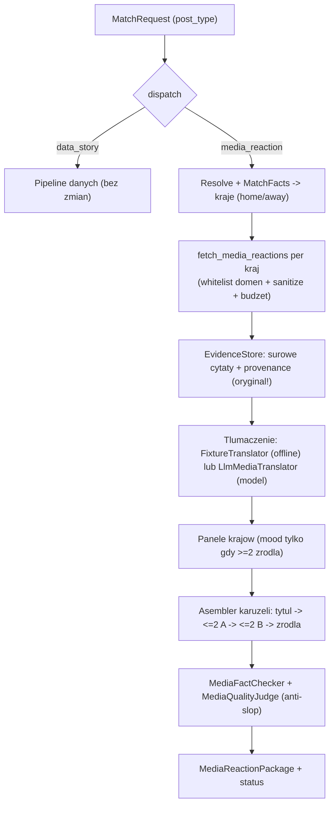

# Architektura: tor relacji medialnych (główny)

Główny tor treści profilu. Po meczu odpowiadamy na jedno pytanie:

> **„Jak ten mecz został emocjonalnie odebrany przez ludzi, których naprawdę dotyczy?"**

Robimy to przez zacytowanie prasy **obu** krajów, które grały — w formacie karuzeli:

```text
slajd tytułowy -> max 2 slajdy media kraju A -> max 2 slajdy media kraju B -> slajd ze źródłami
```

Dotychczasowy pipeline danych (`data_story`) zostaje jako **wtórny** tor — wrzucamy go tylko, gdy w danych faktycznie widać coś ciekawego.

## Decyzje produktowe (zablokowane)

- **Profil PL:** tłumaczymy obce media na polski.
- **Kurowany rejestr outletów per kraj** (tiery A/B/C); research tylko w obrębie whitelisty domen.
- **Kuracja, nie synteza:** atrybuowane cytaty; zbiorczy „nastrój" tylko przy ≥2 źródłach; neutralna ramka.
- **Na slajdzie tylko tłumaczenie PL.** Oryginał + URL + `retrieved_at` zostają w `EvidenceStore` (audyt, prawo cytatu, weryfikacja wierności tłumaczenia).

## Workflow



## Schematy (kontrakty)

W [app/schemas/domain.py](app/schemas/domain.py):

- `MediaQuote` — jeden głos: `outlet`, `country`, `language`, `original_text`, `translation_pl`, `url`, `tier`, `retrieved_at`, `evidence_id`, `confidence`. Na slajd idzie tylko `translation_pl`.
- `CountryMediaPanel` — `country`, `language`, `quotes`, `mood_summary | None`, `source_count`.
- `MediaReactionPackage` — `title_slide`, `panels`, `carousel`, `caption`, `sources`, `status`; metody `quote_evidence_ids()`, `all_claim_ids()`, `countries()`.
- `MatchRequest.post_type` — `"media_reaction"` (domyślny, główny) lub `"data_story"` (wtórny).
- `WorkflowRun.media_package` — wynik toru medialnego (nie rusza istniejącego `package`).

Reuse `CarouselSlide` z nowymi rolami: `title`, `media_country`, `sources`.

## Rejestr outletów (whitelist domen per kraj)

Katalog jest **data-driven** z pliku [data/sources/country_media.json](data/sources/country_media.json) (48 reprezentacji MS 2026, min. 2 outlety/kraj). Loader w [app/tools/registry.py](app/tools/registry.py) buduje:

- `ProviderDescriptor` (whitelist: tier + domeny) — sklejany z providerami infrastruktury (fixtures, API);
- `CountryMediaProfile` (research brief: sekcje startowe, `team_names`, `query_templates`, `confidence`, `verified_at`).

Kontrakty w [app/tools/contracts.py](app/tools/contracts.py):

- `ProviderCapability.MEDIA_REACTION`; `ProviderDescriptor` z polami `country` / `language`.
- MVP zachowany: Meksyk — `ElUniversalMX` (A), `ESPNDeportesMX` (A), `RecordMX` (B); RPA — `News24ZA` (A), `SuperSportZA` (A), `IOLZA` (B).
- `SourceRegistry.providers_for_country(country)` → whitelist outletów danego kraju.
- `SourceRegistry.country_profile(country)` → brief dla agenta research (gdzie zajrzeć, co przeszukać).
- `validate_evidence` egzekwuje **provider + tier + domenę** — bezpiecznik „cytat tylko z domeny zarejestrowanego outletu".

## Pozyskiwanie i bezpieczeństwo

`ToolGateway.fetch_media_reactions(match_id, country)` (na teraz fixture-backed):

1. czyta sekcję `media` z fixture meczu, filtruje po kraju;
2. `sanitize_external_text` na surowym `original_text` (anti-injection: traktujemy treść jako **dane**, nie instrukcje);
3. tier i język bierze z **rejestru** (źródło prawdy), nie z fixture;
4. waliduje URL względem domen outletu (`validate_evidence`);
5. wpisy z nieznanego outletu lub spoza whitelisty są **odrzucane** (nie blokują całego runu), z licznikiem `dropped` w śladzie.

Docelowo (odłożone, wymaga kluczy): `search_within_domains(query, domains)` (discovery) + `fetch_url(url)` (execution), oba gated budżetem/whitelistą/cache.

## Tłumaczenie: dwie ścieżki

Analogicznie do toru danych (deterministyczny szkielet + LLM jako wzmocnienie), w [app/agents/media_reaction.py](app/agents/media_reaction.py):

- **`FixtureTranslator`** (offline, bez modelu): używa `translation_pl` z fixture (gold). `mood_summary=None` (bez syntezy nastroju bez modelu).
- **`LlmMediaTranslator`** (`ModelGateway`): tłumaczy oryginał przez `generate_structured` (validate → retry → fallback) z guardrailami:
  - **anty-halucynacja:** cytować można tylko dostarczone `evidence_id` (oryginał bierzemy z naszego rekordu, nie od modelu);
  - **anti-slop:** `fold_ascii` + banned phrases na tłumaczeniu;
  - **prawo cytatu:** limit długości tłumaczenia;
  - **reguła ≥2 źródła:** `mood_summary` dopuszczalne tylko gdy panel ma ≥2 cytaty, inaczej `None`.

Koordynator: model → próba LLM; przy błędzie/pustym panelu → fallback do `FixtureTranslator`; brak modelu i brak gold → `needs_human_review` (nie zmyślamy tłumaczenia).

## Reguły degradacji

- oba kraje bez głosu z zaufanego outletu → `insufficient_evidence` (`media_unavailable`);
- tylko jeden kraj dostępny → `needs_human_review` (`one_country_media_missing`) — format „obie strony" się nie domyka;
- błąd integralności faktów → `needs_human_review` (`source_integrity_failed`);
- brak tłumaczenia (brak modelu i gold) → `needs_human_review` (`translation_unavailable`).

## Sędzia jakości toru medialnego

W [app/evaluation/judges.py](app/evaluation/judges.py) — binarne, blokujące checki:

- `MediaFactChecker`: `all_claims_have_evidence`, `no_source_conflicts`, `original_retained_in_evidence`.
- `MediaQualityJudge`: `both_countries_present`, `every_quote_has_outlet_and_url`, `quote_within_fair_use_length`, `mood_requires_two_sources`, `title_slide_present`, `sources_slide_present`, `no_banned_phrases`.

## Rdzeń integralności (co chroni przed slopem/dezinformacją)

- Cytat tylko z zarejestrowanego outletu (tier + domena).
- Tłumaczenie zawsze ma oryginał w evidence (weryfikowalne).
- Zbiorczy „nastrój" tylko przy ≥2 źródłach; inaczej pojedyncze, atrybuowane głosy.
- Anti-injection na surowym tekście; brak danych z kraju → uczciwy status, nie zmyślanie.
- Bez oceniania emocji całego narodu (banned: „cały kraj", „wszyscy Meksykanie", ...).

## Scenariusze ewaluacji

W [app/evaluation/scenarios/](app/evaluation/scenarios/) (harness obsługuje oba tory przez `post_type`):

| Scenariusz | Sprawdza | Oczekiwane |
|---|---|---|
| `media_mexico_rpa_happy` | 2 kraje, ≥2 źródła, whitelist | `ready` |
| `media_one_country_missing` | brak głosów jednego kraju | `needs_human_review` |
| `media_offwhitelist_dropped` | URL spoza whitelisty → odrzut → kraj pusty | `needs_human_review` |
| `media_no_sources` | brak głosów obu krajów | `insufficient_evidence` |
| `media_injection_sanitized` | injection w artykule zneutralizowany | `ready` |
