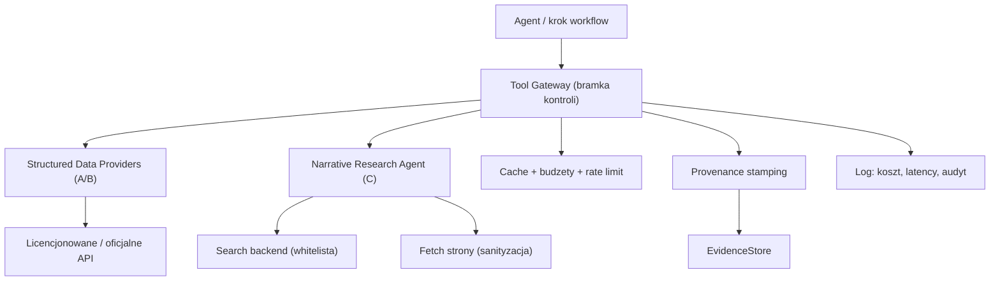

# Architektura warstwy danych: agent research + API

Stan dokumentu: 2026-06-10
Powiazane: `architektura-redakcji-ai-mundial-instagram.md` (sekcje 5.3-5.5).

Cel: zaprojektowac warstwe pozyskiwania danych, ktora karmi istniejacy workflow
(`Mecz -> fakty -> dane -> narracje -> ...`) w sposob legalny, audytowalny i
odporny na halucynacje, niezaleznie od tego, jaki LLM wejdzie pozniej.

## 0. Zasada nadrzedna: separacja po roli dowodowej

Najwazniejsza decyzja architektoniczna tej warstwy. Dane dzielimy nie po zrodle,
tylko po **roli, jaka pelnia w materiale**, i mapujemy to na istniejace tiery:

| Tier | Rola | Skad | Reguly |
|---|---|---|---|
| A | Fakty meczowe | oficjalne/licencjonowane API strukturalne | deterministyczne, wysoka pewnosc, NIGDY z research-agenta |
| B | Metryki | licencjonowane API statystyczne | provider + retrieved_at na kazdej liczbie, konflikty flagowane |
| C | Narracje | agent przeszukujacy internet (media/social) | zawsze `narrative_only`, NIGDY samodzielny fakt |

Konsekwencja: **agent przeszukujacy internet zyje wylacznie w Tier C.** Nigdy nie
ustala wyniku, strzelcow ani xG. Jego output to "co ludzie mowia", ktore dopiero
sprawdzamy danymi z A/B. To jest jednoczesnie bezpiecznik anti-halucynacja,
anti-slop i prawny (nie kopiujemy chronionych tresci jako faktow).

## 1. Architektura wysokiego poziomu



Dwie podsystemy za jedna bramka:

- **Structured Data Providers** - typowane klienty do zrodel A/B. Interfejs
  provider-agnostyczny: workflow nie wie, czy dane przyszly z FBref czy z platnego
  agregatora.
- **Narrative Research Agent** - kontrolowana petla wyszukiwania w internecie,
  ograniczona do Tier C.

## 2. Tool Gateway - odpowiedzialnosci (rozszerzenie obecnej bramki)

Obecna `ToolGateway` loguje wywolania i egzekwuje `SourceRegistry`. Docelowo
przejmuje pelna kontrole:

1. **Whitelista** providerow i domen. Brak na liscie = brak wywolania.
2. **Walidacja parametrow** (typed) przed wykonaniem.
3. **Discovery vs Execution**: model widzi opisy narzedzi (discovery), ale wykonuje
   je bramka (execution) - waliduje, uruchamia, stempluje provenance.
4. **Budzety**: limit kosztu i czasu na run, timeout, retry z backoff, rate limit
   per provider.
5. **Cache**: klucz = `tool + args + provider`, TTL zalezny od trybu
   (`live` krotki, `post_match` dlugi). Cache to tez odtwarzalnosc i zgodnosc
   z takedown.
6. **Provenance stamping**: kazdy wynik -> `EvidenceItem` (provider, source_url,
   tier, retrieved_at, confidence). To juz mamy w `EvidenceStore`.
7. **Wykrywanie konfliktow** miedzy providerami (mamy w `EvidenceStore.conflicts`).
8. **Anti-injection**: tresc z internetu jest DANYMI, nie instrukcja. Structured
   output jako sciana ogniowa. Tekst strony jest opakowywany/escapowany, nigdy
   doklejany jako polecenie.

## 3. Kontrakty narzedzi (typed)

Sygnatury, ktore bramka wystawia. Niezmienne niezaleznie od wyboru providera:

```text
resolve_match(query, date_hint, competition_hint) -> MatchResolution
fetch_match_facts(match_id, provider?) -> (MatchFacts, [EvidenceItem])   # Tier A
fetch_team_stats(match_id, provider?) -> MetricSnapshot | None           # Tier B
fetch_player_stats(match_id, provider?) -> [PlayerMetric]                # Tier B
fetch_public_narratives(match_id, trusted_query_set) -> [PublicNarrative] # Tier C
search_knowledge_base(query, filters) -> [KnowledgeHit]                  # RAG
```

Kazdy wynik niesie `Provenance`. Kazdy provider deklaruje `ProviderDescriptor`
(tier, domeny, capabilities, klasa kosztu, tryb pozyskania, wymagana autoryzacja).

## 4. Structured Data Providers (A/B)

Interfejs `StructuredDataProvider` (Protocol) + rejestr deskryptorow. Fixture staje
sie pierwsza implementacja (`FixtureDataProvider`), wiec testy i workflow nie
zmieniaja sie przy podmianie zrodla.

Kandydaci i ich profil ryzyka (do decyzji - patrz sekcja 8):

| Zrodlo | Tryb | Ryzyko prawne/ToS | Uwaga |
|---|---|---|---|
| Oficjalne API FIFA/UEFA | API | niskie | dostepnosc/zakres ograniczony |
| Platny agregator (np. API-Football, SportMonks, Stats Perform/Opta) | API | niskie (licencja) | koszt, ale czyste prawnie |
| FBref / StatsBomb open | scraping/eksport | srednie | sprawdzic licencje danych |
| FotMob / SofaScore | brak publicznego API | wysokie (ToS) | tylko liczby + atrybucja, ostroznie |

Reguly providerow:
- xG z roznych providerow nie jest laczone bez adnotacji (juz w polityce).
- Brak metryki = `metric_unavailable`, nie zmyslanie (juz egzekwowane przez kod).
- Kazdy provider ma `confidence` i `retrieved_at`.

## 5. Narrative Research Agent (Tier C)

Kontrolowana petla, NIE dowolny browsing. Etapowo:

1. **Skeleton deterministyczny**: search backend na whiteliscie + ekstrakcja
   `PublicNarrative` (text, source_type, url, retrieved_at, `verification_status=narrative_only`).
2. **Z LLM (etap pozniejszy)**: planowanie zapytan (query rewriting), klastrowanie
   i streszczanie "co wszyscy mowia". Pod twardym limitem krokow i structured output.

Granice:
- domeny na whiteliscie (reputowane media); social wylacznie przez oficjalne API
  albo jawnie flagowane;
- output nigdy nie jest faktem - wymaga **handshake weryfikacyjnego** z A/B zanim
  trafi do copy; inaczej copy hedguje albo material idzie do review;
- defensywa anti-injection: tekst strony walidowany schematem, nie wykonywany;
- przechowujemy URL i pochodne, nie masowe kopie chronionych tresci.

Search backend (do decyzji): Tavily / Brave / Bing Search API (legalne, z kluczem)
vs scraping wynikow (ToS-ryzyko, odradzane).

## 6. Mapowanie na istniejacy kod

| Element | Zmiana |
|---|---|
| `app/tools/contracts.py` | NOWY: Protocols + `Provenance` + `ProviderDescriptor` + `ToolBudget` + `ToolPolicy` + `Cache` |
| `SourceRegistry` | rozszerzyc o realne deskryptory providerow (domeny, capabilities, koszt) |
| `ToolGateway` | orkiestrator nad providerami + research-agentem; cache, budzety, rate limit; fixture jako `FixtureDataProvider` |
| `EvidenceItem` | juz niesie provenance - bez zmian kontraktu |
| `EvidenceStore` | bez zmian (konflikty/provenance juz dziala) |
| `WorkflowRun` | dodac koszt/latency per tool call (juz mamy `tool_calls`) |
| Eval harness | dodac scenariusze: provider down, konflikt providerow, injection w narracji |

## 7. Plan budowy (etapowy, kontrakty najpierw)

1. [x] **Kontrakty** (`app/tools/contracts.py`: Protocols + `Provenance` +
   `ProviderDescriptor` + `ToolBudget` + `ToolPolicy` + `Cache`). Straznik driftu:
   fixture-gateway spelnia `StructuredDataProvider`.
2. [x] **Katalog zrodel** (`SourceRegistry` na `ProviderDescriptor`): offline fixtures
   + zatwierdzone providery docelowe (`requires_auth`), zaufanie capability-based.
3. [x] **Warstwa kontrolna bramki** (`app/tools/control.py`, bez kluczy): `TtlCache`,
   `BudgetTracker` (per-run reset), whitelista domen, `sanitize_external_text`
   (anti-injection). Wpiete: budzet w `_log`, sanityzacja narracji, whitelista
   domen w `validate_evidence`.
4. [ ] **Adapter fixture -> osobny `StructuredDataProvider`** + DI wielu providerow w bramce.
5. [ ] **Jeden realny provider A/B** za interfejsem (wybrany w sekcji 8): klient HTTP,
   cache, budzet, testy; tylko fakty/metryki.
6. [ ] **Narrative agent (C)** - skeleton deterministyczny (search API na whiteliscie),
   potem LLM do query/summary.
7. [ ] **Handshake weryfikacyjny** narracja <-> dane + testy anti-injection w harnessie.
8. [ ] **Metryki kosztu/latency** w leaderboardzie (koszt na puszke, tool error rate).

## 8. Decyzje (zatwierdzone 2026-06-10)

1. **Strategia zrodel A/B: tylko licencjonowane/oficjalne API.** Bez scrapingu
   FBref/FotMob/SofaScore. Czysto prawnie; koszt akceptowany. W rejestrze:
   `OfficialMatchApi` (Tier A, fakty) + `LicensedStatsApi` (Tier B, metryki) jako
   deskryptory `requires_auth=True`, do podpiecia HTTP gdy bedzie vendor/klucz.
2. **Zakres research-agenta: tylko narracje (Tier C).** Agent nigdy nie ustala
   faktow ani metryk. Output zawsze `narrative_only`, weryfikowany danymi A/B.
3. **Search backend: legalne API wyszukiwania (Tavily / Brave / Bing) z kluczem.**
   Bez scrapingu SERP. W rejestrze: `SearchApiNarratives` (Tier C, `requires_auth`).
4. Budzet na platne API: do potwierdzenia (klasa kosztu w deskryptorze).
5. Live vs post-match: na start post-match (dluzszy cache TTL); live to pozniejszy etap.

Stan implementacji: deskryptory tych providerow sa juz w `SourceRegistry`
(`requires_auth=True`), ale klienci HTTP nie sa jeszcze podpieci (seam na kolejny
etap). Fixture pozostaje aktywnym providerem MVP.

## 9. Governance i bezpieczenstwo (twarde granice)

- Preferuj licencjonowane/oficjalne API dla A/B; scraping wymaga sign-off prawny/IT.
- Respektuj robots.txt i rate limity; przechowuj liczby + atrybucje, nie masowe tresci.
- Brak klipow/grafik z transmisji (juz regula).
- Social tylko jako Tier C; preferuj oficjalne API; przestrzegaj ToS platform.
- Narzedzia write/post domyslnie zablokowane; pozyskiwanie danych jest read-only.
- Autonomia agenta-research ma limit krokow i budzet, nie tylko instrukcje w promptcie.
